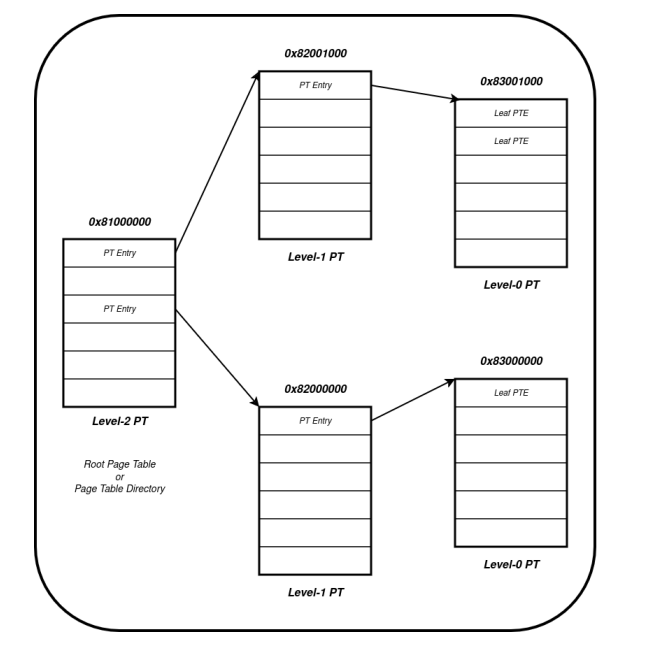
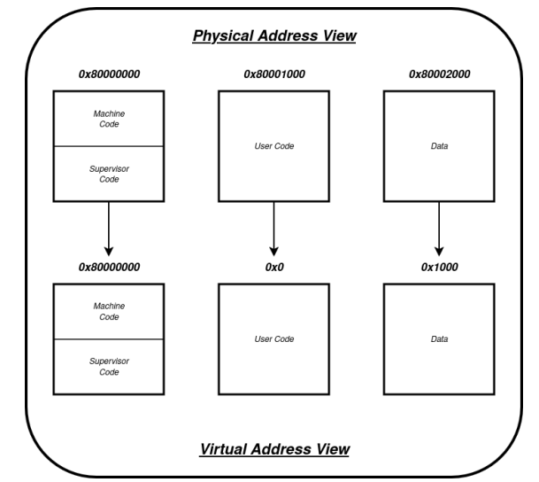

#  Virtual Memory Management in RISC-V (Sv39)

This project explores **virtual memory** in the **RISC-V architecture**, focusing on how paging and memory isolation are handled using **hierarchical page tables** and the **SATP** mechanism.

The assignment gives hands-on experience with:
- Creating and configuring page tables
- Working with different privilege modes (Machine, Supervisor, and User)
- Using the `satp` register for paging
- Verifying address translations on execution

---

##  Problem Overview

Modern computer systems use virtual memory to efficiently manage physical memory and isolate processes. RISC-V supports this using **Sv39 paging**, a hierarchical page table scheme that allows for 39-bit virtual addressing.

In this assignment, we simulate virtual memory behavior by:

1. Switching privilege levels
2. Setting up the page table
3. Configuring the SATP register
4. Entering user mode
5. Observing virtual-to-physical address translation

---

##  Steps Involved

###  Step 1: Switch from Machine Mode to Supervisor Mode

Begin by changing the privilege level of execution using the appropriate CSRs (`mstatus`, `mepc`, etc.).

---

###  Step 2: Initialize the Page Table

Set up the page table entries in memory, following the **Sv39** hierarchical format. Ensure proper alignment and permission bits are configured based on the desired mappings.

---

###  Step 3: Configure the SATP Register

Write the appropriate configuration into the `satp` register:
- Set mode to Sv39
- Assign the physical address of the root page table
- Update other required fields (ASID, etc.)

---

###  Step 4: Switch to User Mode

After configuring the page table and `satp`, switch the privilege level to **User Mode** and start execution.

---

###  Step 5: Observe Address Translation

Check the memory dumps or Spike logs to confirm that physical addresses are being replaced with their corresponding virtual addresses — indicating successful paging.

---

##  Key Concepts Practiced

- RISC-V privilege modes: M-mode, S-mode, U-mode
- CSR manipulation (`mstatus`, `satp`, `mepc`, etc.)
- Page table setup (Sv39)
- Virtual-to-physical address mapping
- SATP configuration and paging enablement

---

##  Tools Used

- [Spike](https://github.com/riscv-software-src/riscv-isa-sim)

---
## To Compile and Create dump file

- riscv64-unknown-elf-gcc -nostartfiles -T linker.ld va_template.S
- riscv64-unknown-elf-objdump -D a.out > dump
 
---

##  Author

R. Meghana — 3rd Year B.Tech CSE, IIT Madras  
This project was done as part of coursework on RISC-V architecture and memory management.

---

